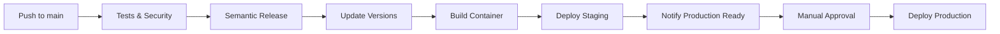
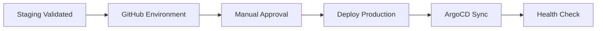

# 🚀 SpaceLaunchNow CI/CD Documentation

## Overview

This document describes the CI/CD pipeline for SpaceLaunchNow-Server, designed with GitOps principles, security-first approach, and developer experience in ### Change Detection & Deployment Flow

The pipeline automatically detects what changed:
- 📦 **Chart files changed** → Increment chart version + update app version
- 🚀 **Only app code changed** → Keep chart version + update app version  
- 📝 **Semantic release created** → Use release version + build number
- 🔄 **No release** → Use pyproject.toml version + build number

**Example Deployment Flow:**
1. Push with `feat: add new endpoint` → Creates v1.3.0 release
2. App version becomes `v1.3.0.1234` (release + build)
3. Container built with exact version from semantic release
4. Deploy to staging → Manual production approval
5. Same tested container deployed to production

### Discord Notifications

- � **Release Created** - New semantic release with changelog link
- 🚀 **Staging Deployed** - Version info and staging URL  
- 🎯 **Production Ready** - Manual approval prompt with workflow link
- ✅ **Production Deployed** - Deployment confirmation

### Benefits

- 🎯 **Version Synchronization** - Container version matches GitHub release  
- 📝 **Automatic Changelogs** - Generated from conventional commits
- ⚡ **Efficient** - Chart version only increments when needed
- 🔍 **Traceable** - Know exactly what changed in each deployment
- 🔄 **GitOps Compliant** - All changes committed to Git
- 🛡️ **Recursion Safe** - Version commits don't trigger new workflowsrchitecture

### Workflow Structure

```
.github/workflows/
├── ci.yml              # Main CI/CD pipeline
├── promote.yml         # Production promotion workflow  
├── dependencies.yml    # Automated dependency updates
├── performance.yml     # Performance testing
├── helm-chart.yml      # Helm chart management
└── python-test.yml     # PR testing (lightweight)
```

### Environments

- **Staging** (`main` branch) → `staging.spacelaunchnow.app` (Auto-deployed)
- **Production** (`main` branch) → `spacelaunchnow.app` (Manual approval)

## 🔄 Deployment Flow

### Automated Pipeline



### Production Deployment Process



## 📋 Workflows

### 1. Main CI/CD Pipeline (`ci.yml`)

**Triggers:**
- Push to `main`
- Pull requests to `main`

**Jobs:**
- 🧪 **Test Suite** - Unit tests, integration tests
- 🔒 **Security Scan** - Vulnerability scanning with Trivy
- 🔍 **Code Quality** - Linting, formatting, type checking
- 📦 **Semantic Release** - Automatic GitHub releases with changelogs
- 📦 **Update App Version** - Chart and app version management
- 🏗️ **Build & Push** - Docker build with semantic release version
- 🚀 **Deploy Staging** - Automatic staging deployment
- 🎯 **Prepare Production** - Discord notification for manual approval
- 🚀 **Deploy Production** - Manual approval via GitHub Environment

**Key Features:**
- **Single Branch**: Only `main` branch workflow
- **Semantic Release**: Automatic GitHub releases from conventional commits
- **Version Sync**: Container version matches GitHub release
- **Staging First**: All changes deploy to staging automatically
- **Manual Production**: Requires explicit approval for production

**Environment Variables:**
```yaml
REGISTRY: registry.digitalocean.com/sln-prod-registry-01
IMAGE_NAME: space-launch-now-base
```

**Semantic Release Features:**
- **Conventional Commits**: Automatic version bumping
- **Generated Changelogs**: From commit messages  
- **GitHub Releases**: With artifacts and release notes
- **Version Integration**: Semantic release version used in app version

**Recursion Prevention:**
- Version update commits include `[skip ci]` to prevent infinite loops
- Workflow conditions check for `[skip ci]` in commit messages

### 2. Production Promotion (`promote.yml`)

**Purpose:** Safely promote staging releases to production

**Manual Inputs:**
- `staging_tag` - Staging image to promote
- `release_version` - Target production version (optional)

**Process:**
1. Validate staging image exists
2. Create production release tag
3. Update production manifests
4. Notify team

### 3. Emergency Rollback (`rollback.yml`)

**Purpose:** Quick rollback for production issues

**Manual Inputs:**
- `environment` - staging/production
- `target_version` - Version to rollback to
- `reason` - Rollback justification

**Process:**
1. Validate target version
2. Update manifests to previous version
3. Verify deployment health
4. Notify team

### 4. Dependency Management (`dependencies.yml`)

**Purpose:** Automated dependency updates

**Schedule:** Weekly (Mondays at 9 AM UTC)

**Process:**
1. Update Python dependencies
2. Run test suite
3. Create PR if updates available
4. Notify team

### 5. Performance Testing (`performance.yml`)

**Purpose:** Load testing for environments

**Manual Inputs:**
- `environment` - staging/production
- `duration` - Test duration
- `concurrent_users` - Load level

**Tools:** K6 for load testing

### 6. Helm Chart Management (`helm-chart.yml`)

**Purpose:** Package, validate, and publish Helm charts

**Manual Inputs:**
- `action` - package/publish/validate
- `chart-version` - Optional version override

**Process:**
1. Generate chart version automatically
2. Validate chart templates and dependencies
3. Package chart for distribution
4. Optionally publish to chart repository

## 📦 Semantic Release & Versioning Strategy

### Semantic Release Integration

The pipeline uses Python Semantic Release for automated version management:

**Conventional Commit Types:**
```bash
feat: new feature        → Minor version bump (1.2.0 → 1.3.0)
fix: bug fix            → Patch version bump (1.2.0 → 1.2.1)
BREAKING CHANGE:        → Major version bump (1.2.0 → 2.0.0)

# Non-release commits (no version bump):
docs: documentation
style: formatting
refactor: code restructure
test: adding tests
chore: maintenance
```

**Generated Changelogs:**
```markdown
## [1.3.0] - 2025-07-01

### Features
- Add new API endpoint for launch predictions
- Implement caching for launch data

### Bug Fixes  
- Fix timezone handling in launch schedules
- Resolve memory leak in data processing
```

### Smart Chart Versioning

**Chart Version (only when k8s/helm/ changes):**
```yaml
# Semantic versioning for chart changes
Chart Version: 0.1.5 → 0.1.6
```

**App Version (every deployment):**
```yaml
# Production: Semantic release version + build number  
App Version: v1.3.0.1234

# No release: Poetry version + build number
App Version: v1.2.5.1235
```

### Change Detection

The pipeline automatically detects what changed:
- � **Chart files changed** → Increment chart version + update app version
- 🚀 **Only app code changed** → Keep chart version + update app version
- � **Discord notifications** show which versions updated

### Benefits

- 🎯 **Semantic Clarity** - Chart version = chart changes, App version = app releases
- ⚡ **Efficient** - Chart version only increments when needed
- � **Traceable** - Know exactly what changed in each deployment
- 🔄 **GitOps Compliant** - All changes committed to Git

See `CHART_VERSIONING.md` for detailed strategy.

## 🔐 Security

### Secrets Management

**GitHub Secrets Required:**
```yaml
DIGITALOCEAN_ACCESS_TOKEN_SLN: # DigitalOcean registry access
GITOPS_TOKEN: # GitHub token for GitOps commits
ARGOCD_TOKEN: # ArgoCD admin token for CLI authentication
PRIVATE_USERNAME: # Private package registry
PRIVATE_PASSWORD: # Private package registry
DISCORD_WEBHOOK: # Build notifications
DISCORD_WEBHOOK_ALERTS: # Alert notifications
```

### ArgoCD CLI Token Setup

The CI/CD pipeline uses ArgoCD's CLI instead of direct Kubernetes access for better security and usability. Follow these steps to set up the required token:

### Step 1: Access ArgoCD

1. **Go to ArgoCD UI:** https://argo.spacelaunchnow.app
2. **Login with admin credentials**

### Step 2: Generate Admin Token

```bash
# Using ArgoCD CLI (if you have it installed)
argocd login argo.spacelaunchnow.app --grpc-web
argocd account generate-token --account admin --grpc-web

# Or via ArgoCD UI
# Settings → Accounts → admin → Generate New Token
```

### Step 3: Add to GitHub Secrets

1. Copy the generated token
2. Go to repository **Settings** → **Secrets and variables** → **Actions**
3. Add new secret: `ARGOCD_TOKEN`
4. Paste the token value

### Step 4: Verify Access

Test the token works:
```bash
# Test CLI access with token
argocd login argo.spacelaunchnow.app --auth-token "YOUR_TOKEN" --insecure --grpc-web
argocd app list --grpc-web
```

**Benefits of ArgoCD CLI vs API:**
- 🔧 **Simpler syntax** - No complex curl commands
- ✅ **Built-in waiting** - `argocd app wait` handles timeouts
- 📊 **Better output** - Cleaner status reporting
- 🛡️ **Same security** - Uses same authentication as API

### Security Features

- 🔒 **No Kubernetes credentials in workflows** - Uses ArgoCD API exclusively
- 🛡️ **Vulnerability scanning on every build**
- 🔍 **SARIF integration for security findings**
- 🎯 **Minimal permission principle**
- 🔐 **Secret scanning protection**
- 🔄 **GitOps-only deployments** - No direct cluster access

## 🧪 Testing Strategy

### Test Types

1. **Unit Tests** - Fast, isolated component tests
2. **Integration Tests** - Database and API integration
3. **Security Tests** - Vulnerability and dependency scanning
4. **Performance Tests** - Load testing with K6
5. **Migration Tests** - Database migration validation

### Coverage Requirements

- **Minimum Coverage:** 80%
- **Coverage Reports:** Uploaded to GitHub artifacts
- **Failed Tests:** Block deployment

## 📦 Container Strategy

### Image Tagging

```bash
# Production builds (main branch)
main-abc1234           # Branch + commit hash  
v1.3.0                 # Semantic release version
latest                 # Latest main build

# Container versioning examples:
# - Semantic release created: v1.3.0.1234 (release + build)  
# - No release: v1.2.5.1235 (pyproject.toml + build)
```

### Registry Structure

```
registry.digitalocean.com/sln-prod-registry-01/
└── space-launch-now-base/
    ├── main-abc1234
    ├── v1.3.0
    ├── latest
    └── production (tagged during promotion)
```

## 🔄 GitOps Integration

### Repository Structure

```
manifests/
├── apps/
│   ├── staging/
│   │   ├── kustomization.yaml    # Image tag updates here
│   │   └── values-staging.yaml
│   └── production/
│       ├── kustomization.yaml    # Image tag updates here  
│       └── values-prod.yaml
└── argocd/
    ├── applications/
    └── projects/
```

### ArgoCD Applications

- **sln-staging** - Monitors `manifests/apps/staging/` (auto-syncs from main)
- **sln-production** - Monitors `manifests/apps/production/` (manual approval required)

### Sync Strategy

- **Auto-sync enabled** for both environments
- **Self-heal enabled** to maintain desired state
- **Prune enabled** to remove orphaned resources

## 📊 Monitoring & Observability

### Deployment Tracking

- 📈 **GitHub Actions logs** for build/deploy status
- 🎯 **ArgoCD dashboard** for sync status
- 📢 **Discord notifications** for team updates
- 📊 **Artifact uploads** for test reports

### Health Checks

- ✅ **Kubernetes readiness probes**
- 🔍 **Application health endpoints**
- 📈 **Performance metrics collection**
- 🚨 **Alert integration**

## 🎯 Developer Workflow

### Feature Development

1. **Create feature branch** from `main`
2. **Make changes** with conventional commit messages
3. **Create PR to main** → triggers tests automatically
4. **Merge to main** → automatic pipeline:
   - Semantic release (if applicable)
   - Version updates  
   - Build container
   - Deploy to staging
   - Notify production ready
5. **Test in staging environment**
6. **Approve production deployment** in GitHub Actions
7. **Same container deploys to production**

### Conventional Commit Examples

```bash
# Feature (minor version bump)
feat: add launch countdown API endpoint
feat(api): implement caching for launch data

# Bug fix (patch version bump)  
fix: resolve timezone handling in schedules
fix(database): correct connection pool configuration

# Breaking change (major version bump)
feat!: migrate to new authentication system
feat: remove deprecated v1 API endpoints

BREAKING CHANGE: The v1 API endpoints have been removed.

# Non-release commits (no version bump)
docs: update API documentation
style: format code with prettier
refactor: extract launch service logic
test: add unit tests for countdown feature
chore: update dependencies
ci: improve build performance
```

### Emergency Procedures

#### Production Hotfix

1. **Create hotfix branch** from `main`
2. **Make minimal fix** with conventional commit
3. **Test locally**
4. **Create PR to main**
5. **Emergency merge** → triggers semantic release (if applicable)
6. **Auto-deploys to staging** → manual production approval
7. **Monitor deployment**

#### Emergency Rollback

1. **Run rollback workflow**
2. **Select target version**
3. **Provide rollback reason**
4. **Execute rollback**
5. **Verify system health**

## 📚 Best Practices

### Branch Strategy

- **main** - Production-ready code (single source of truth)
- **feature/** - Feature development branches
- **hotfix/** - Emergency production fixes

**Simplified Flow:**
- All development branches merge to `main`
- `main` automatically deploys to staging
- Manual approval required for production
- No separate `develop` branch needed

### Commit Messages

Follow [Conventional Commits](https://www.conventionalcommits.org/) specification:

```bash
# Format: <type>(<scope>): <description>

feat: add new API endpoint for launches
fix: resolve database connection issue  
docs: update deployment documentation
ci: improve test performance
chore: update dependencies

# Breaking changes
feat!: migrate to new authentication system
```

**Commit Types:**
- **feat**: New feature (triggers minor version)
- **fix**: Bug fix (triggers patch version)  
- **docs**: Documentation changes
- **style**: Code formatting changes
- **refactor**: Code refactoring
- **test**: Adding or updating tests
- **chore**: Maintenance tasks
- **ci**: CI/CD changes
- **BREAKING CHANGE**: Breaking changes (triggers major version)

### PR Guidelines

- **Clear description** of changes
- **Link to issues** if applicable
- **Test coverage** for new features
- **Security considerations** documented
- **Performance impact** assessed

### Release Management

- **Semantic versioning** (v1.3.0) - automatically managed
- **Release notes** - generated from conventional commits
- **Changelogs** - automatic from commit messages  
- **GitHub releases** - created automatically with artifacts
- **Rollback procedures** - documented and tested

## 🚀 Getting Started

### Running Locally

```bash
# Clone repository
git clone https://github.com/thespacedevs/SpaceLaunchNow-Server
cd SpaceLaunchNow-Server

# Run tests
docker compose -f docker/docker-compose.test.yml run --rm test

# Build image
docker build -t space-launch-now-base .
```

### Manual Deployment

```bash
# Manual production approval via GitHub UI
# 1. Go to Actions → CI/CD Pipeline → Latest run
# 2. Review staging deployment
# 3. Approve production environment
# 4. Monitor deployment status

# Emergency rollback (if needed)
gh workflow run rollback.yml \
  -f environment=production \
  -f target_version=v1.2.0 \
  -f reason="Critical API bug"
```

## 🔧 Troubleshooting

### Common Issues

#### Build Failures

1. **Check test logs** in GitHub Actions
2. **Review code changes** in failing commits
3. **Run tests locally** to reproduce
4. **Check dependency conflicts**

#### Deployment Issues

1. **Check ArgoCD status** at https://argo.spacelaunchnow.app
2. **Review pod logs** in Kubernetes
3. **Verify image availability** in registry
4. **Check resource constraints**

#### Performance Issues

1. **Run performance tests** to baseline
2. **Review application metrics**
3. **Check database performance**
4. **Analyze resource usage**

### Support Contacts

- **DevOps Issues:** #devops Discord channel
- **Security Concerns:** #security Discord channel  
- **General Support:** #support Discord channel

---

## 📝 Migration Guide

### From Old CI/CD

The new system replaces these old workflows:
- ❌ `build-master.yml`  
- ❌ `build-production-argocd.yml`
- ❌ `build-production-optimized.yml`
- ❌ `build-staging-argocd.yml` 
- ❌ `build-staging-optimized.yml`
- ❌ `build-release.yml`
- ❌ Multiple develop/main branch workflows

### Key Changes

1. **Single main workflow** instead of multiple overlapping ones
2. **Main branch only** instead of develop/main branching
3. **Semantic release integration** with automatic changelogs
4. **Version synchronization** between releases and containers
5. **Staging-first deployment** with manual production approval
6. **GitOps-only deployments** instead of direct kubectl
7. **Enhanced security** with minimal credentials
8. **Recursion prevention** for version update commits

### Migration Steps

1. ✅ **Updated to single branch workflow** 
2. ✅ **Implemented semantic release** with conventional commits
3. ✅ **Added recursion prevention** for version commits
4. ✅ **Simplified deployment flow** (main → staging → production)
5. ✅ **Enhanced Discord notifications** with release info
6. ✅ **Version synchronization** between GitHub releases and containers

### Breaking Changes

- **No more develop branch** - all development happens on feature branches merged to main
- **Conventional commits required** - for automatic version bumping and changelog generation
- **Manual production approval** - no more automatic production deployments
- **Semantic versioning** - versions now follow semantic versioning instead of date-based

---

*Last updated: 2025-07-01*
*Version: 2.0 - Simplified Single Branch with Semantic Release*
